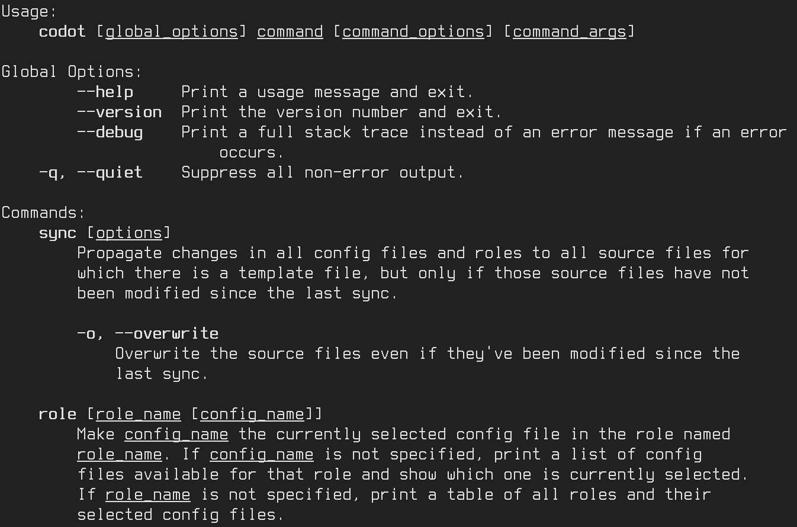

linotype
========

linotype is a program for generating help messages for your program that are
formatted automatically. Messages are defined in the code using a simple
interface and can be printed to the terminal and/or imported into your Sphinx
documentation, which removes the need for duplicate documentation. Line
wrapping, indentation, alignment and markup are all applied automatically,
making your help message easier to maintain so that you can focus on the
content.

`Documentation <https://linotype.readthedocs.io/en/latest/index.html>`_
